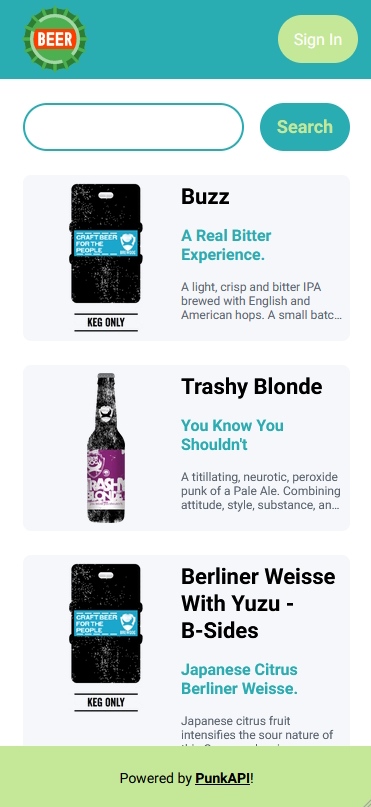
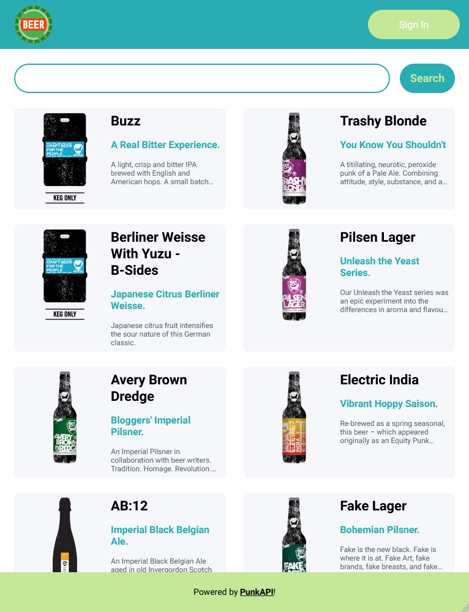
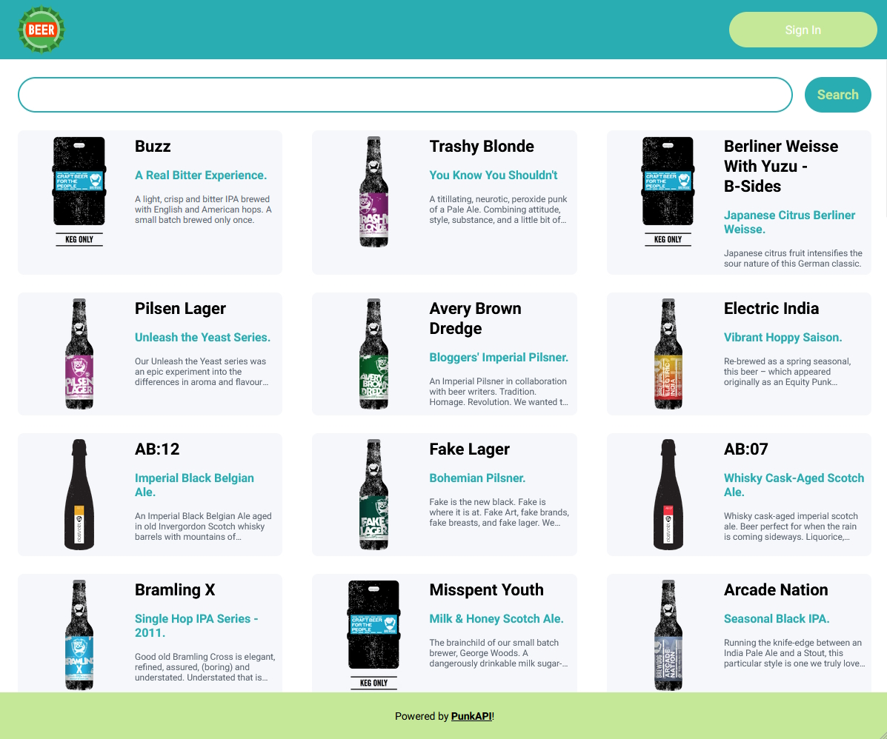
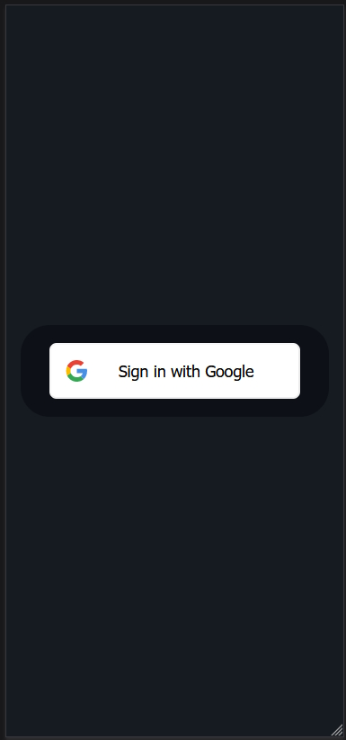
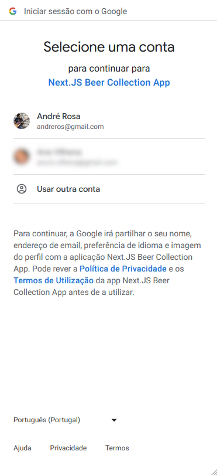
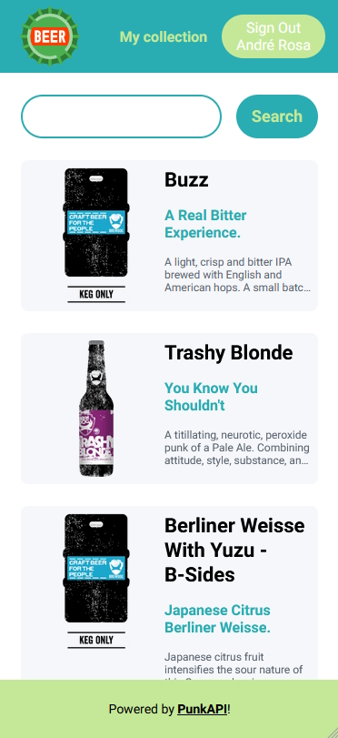
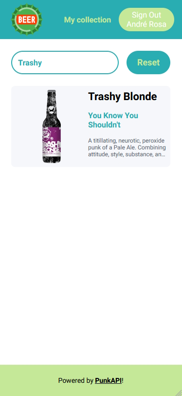
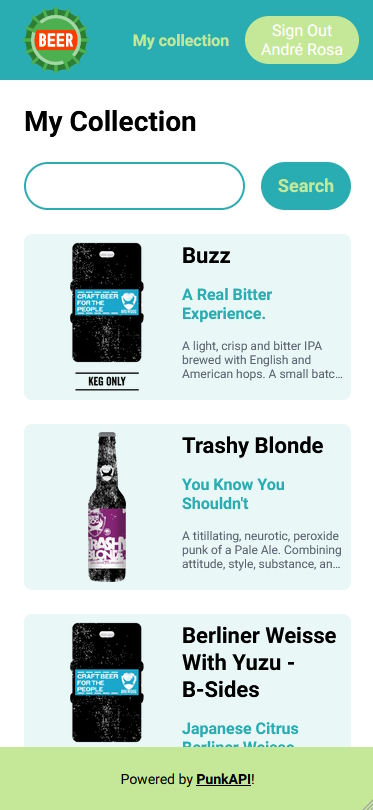
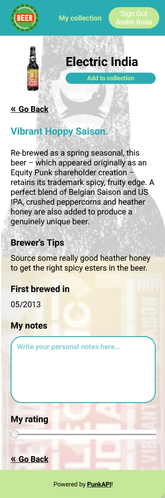
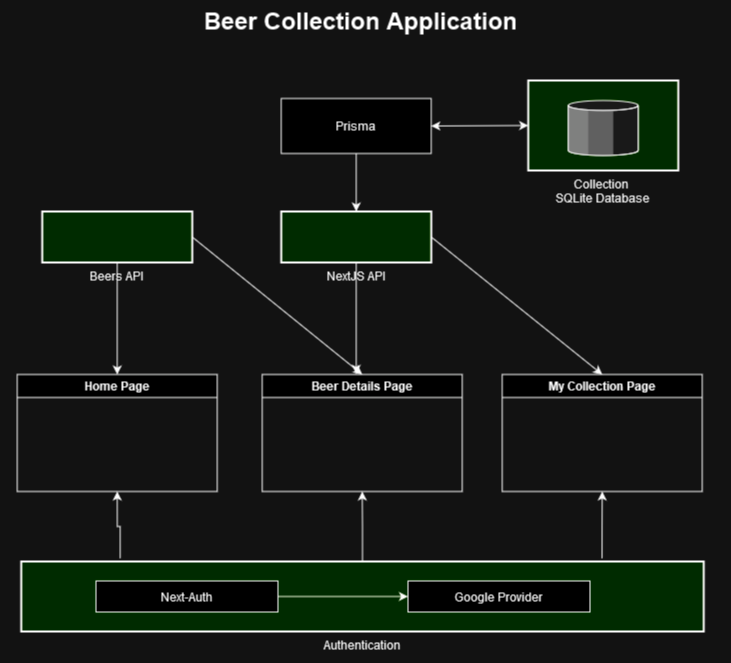

# nextjs-beer-collection-app

Next.JS Beer Collection - Example Application

Beer Collection example application implemented with 2023 Next.JS latest version, technologies, methodologies, best practices and frameworks available within the React ecosystem.

## Screenshots

<br/>
<br/>
<br/>
<br/>
<br/>
<br/>
<br/>
<br/>
<br/>

## Architecture

<br/>

The application consists of three different screens.

The first screen is the homepage which lists available beers in the [PunkAPI](https://punkapi.com/documentation/v2). This list supports a search by beer name.

The second screen is the Beer Details page. This page has the beer public info and some authenticated features that allow the application user to add or remove the beer to his collection, write down some notes about the beer and also a personal beer rating.

The third screen is the user beer collection, featuring a list of the beers the user added to his collection. This list also supports a search by beer name.

The application layout was designed and implemented to adapt to any screen resolution, from a mobile phone to a tablet device to a desktop computer.

## Tech Stack

-   `Next.JS` React framework (with Typescript) for the building blocks to create the web application;
-   `React` framework (with Typescript) for the overall application development;
-   `Next-Auth` software library to implement authentication;
-   `Prisma (ORM)` software library for Object-Relation Mapping between the database and the application;
-   `SQLite` relational database for the applicaiton data storage;
-   `SASS` to build the needed application styles;
-   `Axios` to communicate with the backend API;

## Testing tools

-   `Jest` javascript testing framework;
-   `React Testing Library` testing framework for working with React components;

## Unit tests

Unit testing was implemented for one component as an example on how the unit testing implementation should be done in the project.

Unit test coverage functionality is not working correctly.

## Installation and application bootstrap

From the project root folder, please execute the following commands in a terminal window:

First, run the development server:

```bash
npm i & npm run dev
```

Open [http://localhost:3000](http://localhost:3000) with your browser to see the result.

## IMPORTANT: Known issues

1 - The authenticated mechanism provided by `Next-auth` has revealed itself as not very reliable. Sometimes the user session authentication data fails to be retrieved causing major problems to the application correct functioning.

2 - There is a known performance issue with the `Prisma client / SQLite` combination scenario resulting in very nasty `500 server errors` being triggered on database fast concurrent accesses. A workaround was implemented in the "**Beer Details Page**". It is not an elegant workaround, but for the time being it solves this issue. Not scalable, though.

## Where to go from here (read it "further improvements")

-   Home page listing loads a constant number of records (48 records in this case). It would be nice to implement a "Load more" button or a "pagination" system;
-   It wouuld also be nice to implement some list sorting for a more versatile list controlling;
